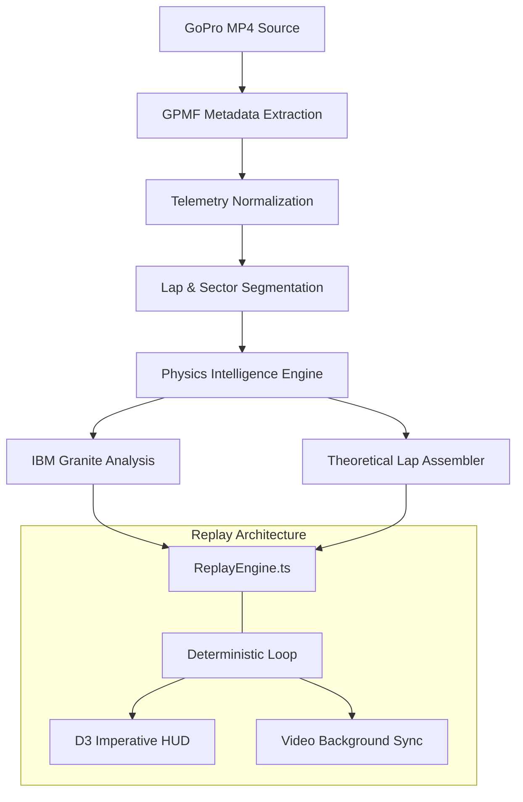

# PITWALL // AI RACE ENGINEER
### THE CINEMATIC RECONSTRUCTION OF PEAK PERFORMANCE

[](https://github.com/labreo/pitwall)
[](https://github.com/labreo/pitwall)
[](https://github.com/labreo/pitwall)

> **PitWall is not a dashboard.** It is a cinematic AI race engineering replay system that transforms raw GoPro footage into a high-fidelity, deterministic performance reconstruction. 

---

## 01 // THE INTELLIGENCE GAP
Amateur racing produces gigabytes of telemetry data, but interpretation remains a luxury of professional teams. Drivers have access to their speed, but they lack the **Engineering Context** to know *why* they are losing time. 

**PitWall** bridges this gap. It doesn't just show you data; it reconstructs your session into an actionable, cinematic debrief.

---

## 02 // WHAT PITWALL ACTUALLY IS
PitWall is a mission-control environment for drivers. It ingests raw video and telemetry to produce:
*   **Deterministic Replay Engine**: A synchronized video and telemetry playback suite running outside the React render loop for 60FPS precision.
*   **Theoretical Perfect Lap**: A real-time, stitched reconstruction of your "Perfect Lap" using the best recorded geographic sectors across the session.
*   **Grounded AI Coaching**: IBM Granite-powered analysis that narrates findings generated by deterministic physics algorithms, grounded in professional racing knowledge.

---

## 03 // CORE CAPABILITIES

### 🏁 THEORETICAL BEST LAP GENERATOR
The core innovation of PitWall. The system identifies the fastest version of every geographic sector in your session and stitches them into a seamless, continuous "Perfect Lap" ghost run. 
*   **Video-Sector Sync**: The background video automatically jumps to the correct footage for each stitched segment.
*   **Sector Provenance**: HUD callouts identify which lap provided each "Best Sector."

### 📡 DYNAMIC REPLAY HUD
A professional motorsport broadcast overlay providing:
*   **Live G-Force Analysis**: Derived from GPS telemetry for longitudinal and lateral load visualization.
*   **Sector Timing HUD**: Real-time "Purple/Green/Red" delta indicators against session benchmarks.
*   **Braking Zone Intelligence**: Heatmapped track overlays showing precise deceleration phases.

### 🧠 IBM-ENHANCED COACHING
PitWall uses a dual-layer intelligence architecture:
1.  **Physics Layer**: Deterministic algorithms calculate time loss, cornering efficiency, and braking deltas.
2.  **Narrative Layer**: **IBM Granite** (via Langflow) consumes these findings and narrates them through an "Engineer Radio" interface, grounded in racing logic using **IBM Docling**.

---

## 04 // SYSTEM ARCHITECTURE



### TECHNICAL HIGHLIGHTS
*   **Deterministic Timing**: The `ReplayEngine` operates independently of the React lifecycle using `requestAnimationFrame` for microsecond-precision synchronization.
*   **Spatial Sector Matching**: Stitches theoretical laps based on geographic coordinates rather than indices, ensuring perfect track continuity.
*   **Imperative HUD Updates**: HUD telemetry bypasses React state entirely, updating the DOM directly via `Ref` callbacks for zero-latency UI response.

---

## 05 // THE TECH STACK

| COMPONENT | TECHNOLOGY |
| :--- | :--- |
| **Frontend UI** | React 18, Vite, Framer Motion |
| **Replay Rendering** | D3.js (Imperative), Vanilla CSS |
| **Backend API** | Python, FastAPI |
| **Data Processing** | FFmpeg, GPMF-parser |
| **AI Orchestration** | Langflow |
| **AI Model** | IBM Granite (via Ollama/WatsonX) |
| **Knowledge Base** | IBM Docling |

---

## 06 // GETTING STARTED

### PREREQUISITES
*   **Python 3.10+**
*   **Node.js 18+**
*   **FFmpeg** (with metadata support)
*   **Ollama** (running `granite-code:8b` or `granite-3.0-8b-instruct`)

### INSTALLATION

1. **Clone the repository**
   ```bash
   git clone https://github.com/labreo/pitwall
   cd PitWall
   ```

2. **Frontend Setup**
   ```bash
   cd frontend
   npm install
   npm run dev
   ```

3. **Backend Setup**
   ```bash
   cd ../backend
   pip install -r requirements.txt
   python -m app
   ```

4. **IBM Intelligence Setup**
   Ensure your Langflow instance is running and configured to communicate with the PitWall backend.

---

## 07 // ROADMAP
*   [ ] **Watson TTS Integration**: Real-time "AI Engineer" voiceovers during replay.
*   [ ] **Granite Vision**: Automatic detection of track hazards and flags from raw video.
*   [ ] **The Garage**: Persistent session history for year-over-year driver progress tracking.
*   [ ] **Cloud Reconstruction**: Offloading heavy video metadata extraction to IBM Cloud.

---

## 08 // WHY THIS MATTERS
Professional racing has moved beyond "driving fast" and into "data engineering." PitWall democratizes this technology, giving every amateur driver a seat at the professional engineering table. It’s not just about seeing your mistakes—it’s about **watching your potential.**

---

**Developed for the IBM / Labreo Hackathon 2026**
