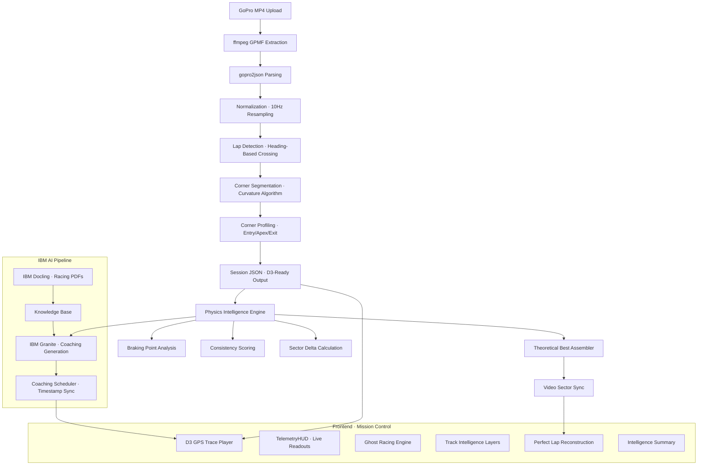

# PITWALL // AI RACE ENGINEER
### THE CINEMATIC RECONSTRUCTION OF PEAK PERFORMANCE

<div align="center">

[](https://github.com/labreo/pitwall)
[](https://github.com/labreo/pitwall)
[](https://github.com/labreo/pitwall)
[](https://github.com/labreo/pitwall)
[](https://github.com/labreo/pitwall)
[](LICENSE)

</div>

---

<!-- 
  IMAGE 1: HERO BANNER
  Shoot: Full-screen screenshot of the replay environment mid-session.
  The car marker should be mid-corner on the GPS trace, the timing HUD
  showing a green delta, ghost visible on track, coaching radio subtitle
  active on screen. This is the first thing judges see. Make it cinematic.
  Suggested filename: docs/images/hero_replay.png
-->
<div align="center">
  
  <p><em>PitWall Mission Control — Real GPS trace, deterministic replay, IBM Granite coaching</em></p>
</div>

---

> **PitWall is not a dashboard.**  
> It is a cinematic AI race engineering system that transforms raw GoPro footage into a professional-grade performance reconstruction — the same intelligence F1 teams pay millions for, available to any driver with a camera.

---

## 01 // THE PROBLEM

Every weekend, thousands of amateur and club racing drivers hit track days. They have GoPro cameras. They have footage. After every session they have **zero engineering feedback.**

A professional race engineer analyzes telemetry, identifies braking points, spots consistency failures, and tells the driver exactly what to fix. This costs £500–£2000 per day and is standard at every professional level. Below that, it doesn't exist.

The gap is not the data. The GoPro in their bag is already recording GPS at 18Hz, G-force at 200Hz, and speed continuously. **The gap is the engineering intelligence to interpret it.**

PitWall closes that gap completely.

---

## 02 // THE SOLUTION

One upload. Four phases. Professional intelligence.

```
GoPro Footage Upload
        ↓
Cinematic Forensics Sequence
(GPMF extraction → lap detection → corner segmentation → session build)
        ↓
Mission Control Replay
(GPS trace · telemetry HUD · ghost racing · track intelligence layers · Granite coaching)
        ↓
Theoretical Best Lap Reconstruction
(fastest sectors stitched · video sync · sector provenance)
        ↓
Intelligence Summary
(consistency score · critical corners · driver strengths · actionable priorities)
```

---

## 03 // CORE CAPABILITIES

### 🏁 THEORETICAL BEST LAP GENERATOR

<!-- 
  IMAGE 2: THEORETICAL BEST LAP
  Shoot: The moment the perfect lap reconstruction triggers. The cinematic
  overlay should be visible. Show the sector callout UI — "BEST EXIT // FROM LAP 3"
  — with the video jumping to the correct footage in the background.
  This is your most unique feature. Give it the most dramatic screenshot.
  Suggested filename: docs/images/theoretical_best.png
-->
<div align="center">
  
  <p><em>The Perfect Lap — constructed from your best sectors, played back with your real footage</em></p>
</div>

The centrepiece of PitWall. The system identifies the fastest version of every geographic sector across your session and stitches them into a seamless composite lap that never actually happened — then plays it back with your real GoPro footage synchronized to each sector.

**How it works:**
- Every lap is divided into geographic sectors using GPS coordinate clustering
- The fastest recorded time through each sector is identified across all laps
- A seamless composite replay is constructed from these optimal segments
- The background video automatically jumps to the correct lap footage for each sector
- HUD callouts identify the provenance of each best segment: *"BEST EXIT // FROM LAP 3"*

**Why it matters:** No other amateur motorsport tool reconstructs a theoretical best lap with real video sync. You watch the best version of yourself that never existed.

---

### 📡 MISSION CONTROL REPLAY

<!-- 
  IMAGE 3: MISSION CONTROL OVERVIEW
  Shoot: Wide view of the full replay environment. Show all elements
  simultaneously — GPS trace with speed gradient coloring, animated car
  marker, timing HUD in corner, video playing in background, coaching
  radio subtitle active. Capture it during an active replay not paused.
  Suggested filename: docs/images/mission_control.png
-->
<div align="center">
  
  <p><em>Mission Control — synchronized video, telemetry, GPS trace, and ghost racing simultaneously</em></p>
</div>

A professional motorsport broadcast environment built on a deterministic replay engine:

- **Synchronized Multi-Stream Playback** — GoPro video, live telemetry readouts, and GPS trace animate simultaneously, locked to the same timestamp
- **Ghost Racing System** — Session best ghost rendered on the track with live delta tracking (green/red/gold timing HUD)
- **Sector Timing HUD** — Real-time purple/green/red delta indicators against session benchmarks and personal bests
- **Live Telemetry** — Speed, G-force (longitudinal and lateral), and heading derived directly from GPS metadata

The replay engine runs outside the React render loop via `requestAnimationFrame`, with D3 handling all rendering imperatively. Zero React re-renders during playback. 60FPS precision regardless of session length.

---

### 🔥 TRACK INTELLIGENCE LAYERS

<!-- 
  IMAGE 4: TRACK INTELLIGENCE LAYERS
  Shoot: The track map with intelligence overlays toggled ON.
  Ideal shot: Consistency Heat Layer active showing green-to-red gradient
  across the circuit, with Braking Zone clouds visible at the heavy
  braking zones. The car marker should be visible on the trace.
  Toggle between layers and pick the most visually dramatic frame.
  Suggested filename: docs/images/track_intelligence.png
-->
<div align="center">
  
  <p><em>Track Intelligence — the circuit surface becomes a live performance analysis layer</em></p>
</div>

The GPS track map is not a static visualization. It is a live performance surface with toggleable intelligence overlays:

| Layer | What It Shows |
|---|---|
| **Racing Line** | Actual GPS path of each lap — the base visual truth |
| **Consistency Heat** | Green → red variance map showing line repeatability across the circuit |
| **Braking Zones** | Translucent heatmap clouds showing where braking begins and how consistent it is |
| **Corner Analytics** | Real-time corner classification firing as the car passes each segment |

The track itself becomes the analysis surface. This approach — continuous spatial intelligence across the full circuit rather than discrete event markers — is the core design philosophy of PitWall's visualization layer.

> **Design note:** This visualization approach is inspired by cricket's Wagon Wheel statistic, adapted from discrete event mapping into a continuous spatial intelligence model for motorsport.

---

### 🧠 IBM-ENHANCED COACHING

<!-- 
  IMAGE 5: GRANITE COACHING RADIO
  Shoot: The coaching radio subtitle firing mid-corner during replay.
  The subtitle should show a specific, data-referenced coaching line —
  ideally something like "Turn 3 — braking 12m late, exit 132 vs target 145."
  Show the HUD and the track map in the same frame so context is clear.
  Suggested filename: docs/images/coaching_radio.png
-->
<div align="center">
  
  <p><em>Engineer Radio — IBM Granite coaching fires at the exact telemetry moment, not generically</em></p>
</div>

PitWall uses a strict two-layer intelligence architecture that separates physics from language:

**Layer 1 — Physics Engine (Deterministic Python)**
All performance metrics are computed before any AI model is invoked:
- Braking point identification (deceleration threshold detection)
- Corner entry/apex/exit speed profiling
- Sector time delta calculation against personal best and theoretical best
- Consistency scoring from GPS line variance
- Fatigue detection from late-session performance degradation

**Layer 2 — Narrative Engine (IBM Granite)**
IBM Granite receives structured, pre-computed findings and generates coaching language:
- Coaching lines are specific and referenced: *"Turn 3 — braking 12 meters too late, exit speed 132 km/h against a target of 145"*
- IBM Docling pre-parses racing theory PDFs, FIA regulations, and track guides into a structured knowledge base that grounds every coaching output
- Coaching fires as radio audio with subtitle overlay, synchronized to the correct telemetry timestamp via the coaching scheduler

**Why this matters:** Granite explains findings. It does not produce them. This separation ensures every coaching line is traceable to a deterministic metric — not an LLM guess.

---

### 📊 INTELLIGENCE SUMMARY

<!-- 
  IMAGE 6: INTELLIGENCE SUMMARY SCREEN
  Shoot: The full Intelligence Summary screen after a complete session.
  Show the PB vs Theoretical Best delta prominently, the consistency
  score, and at least two Critical Corner cards with their mini-maps.
  If Driver Strengths are visible include those too.
  Suggested filename: docs/images/intelligence_summary.png
-->
<div align="center">
  
  <p><em>Intelligence Summary — the race engineer debrief, generated automatically after every session</em></p>
</div>

When the session ends, PitWall automatically generates a complete race engineering debrief:

- **PB vs Theoretical Best** — exact potential gain in seconds (e.g. *-1.245s*)
- **Consistency Score** — 0–100 calculated from flying-lap variance, ignoring out-laps
- **Critical Time Loss Corners** — top 3 corners costing the most time, each with a mini-map wireframe and IBM Granite recommendation
- **Driver Strengths** — technical skill recognition: Brake Stability, Line Precision, Throttle Control
- **Actionable Priorities** — specific to-do list for next session

---

## 04 // IBM AI INTEGRATION

<!-- 
  IMAGE 7: LANGFLOW PIPELINE DIAGRAM
  Shoot: Screenshot of your Langflow visual pipeline.
  Show the nodes connected: Telemetry Input → Docling Knowledge Base
  → Granite Model → Coaching Output. This is the IBM proof screenshot.
  Make sure it's clean and the node labels are readable.
  Suggested filename: docs/images/langflow_pipeline.png
-->
<div align="center">
  
  <p><em>IBM AI Pipeline — Langflow orchestrating Docling knowledge grounding and Granite coaching generation</em></p>
</div>

| IBM Tool | Role | Integration Point |
|---|---|---|
| **IBM Granite** | Coaching language generation + Intelligence Summary recommendations | Receives structured corner performance data from the physics engine. Produces coaching lines and debrief text. |
| **IBM Docling** | Racing theory PDF parsing → structured knowledge base | Pre-parses FIA regulations, racing line theory, and track guides. Grounds all Granite output in real motorsport knowledge. |
| **Langflow** | Visual AI pipeline orchestration | Wires Docling knowledge base → Granite model → coaching output. Handles prompt templating and model routing. |

**Architecture principle:** IBM tools sit on top of deterministic engineering. Granite is the narrator of findings produced by real algorithms. This is visible in the codebase and in the Langflow pipeline diagram above.

---

## 05 // SYSTEM ARCHITECTURE



---

## 06 // TECHNICAL ARCHITECTURE

### Data Pipeline

| Stage | Technology | Output |
|---|---|---|
| Video ingest | ffmpeg, gopro2json | Raw GPMF telemetry stream |
| Normalization | Python, NumPy, Pandas | 10Hz synchronized timeline |
| Lap detection | Custom heading-crossing algorithm | 9 laps · ~109s average · Donington Park |
| Corner segmentation | GPS curvature algorithm | Entry/apex/exit per corner with confidence score |
| Session output | Normalized JSON | D3-ready structured session object |

### Replay Engine

| Component | Technology | Design Decision |
|---|---|---|
| Replay loop | requestAnimationFrame | Runs outside React render cycle entirely |
| Track rendering | D3.js imperative SVG | Zero React re-renders during playback |
| State management | Zustand | Low-frequency UI state only |
| HUD updates | DOM Ref callbacks | Direct DOM writes for zero-latency telemetry display |
| Ghost system | Interpolation-based replay | Timestamp-synchronized against replay engine clock |

### Why GPS, Not TORCS

TORCS provides ~30 fixed predefined tracks. Real drivers race everywhere. PitWall renders the driver's actual GPS trace — their real circuit, drawn from their own coordinates. This means PitWall works on any track in the world from a single upload.

The TORCS GitHub Learning Lab is completed separately as the IBM submission requirement.

---

## 07 // DEMO DATA

The prototype is validated on real telemetry from a professional motorcycle rider at **Donington Park** (No-Limits-Racing 765RS Cup). The dataset contains 9 complete flying laps at approximately 109 seconds per lap, extracted from GoPro Hero GPMF metadata.

PitWall is vehicle-agnostic. The telemetry pipeline reads GoPro GPMF streams identically for cars and motorcycles. The Donington Park dataset was selected for its data quality and public availability.

<!-- 
  IMAGE 8: DONINGTON TRACK RECONSTRUCTION
  Shoot: The refined_track_segments.png output from your Python pipeline
  OR a screenshot of the GPS trace rendered in the frontend showing the
  full Donington Park layout reconstructed from real GPS coordinates.
  Label it clearly — judges need to see this is a real track, not a template.
  Suggested filename: docs/images/donington_reconstruction.png
-->
<div align="center">
  
  <p><em>Donington Park reconstructed from raw GPS coordinates — no template, no fixed map</em></p>
</div>

---

## 08 // GETTING STARTED

### Prerequisites

- Python 3.10+
- Node.js 18+
- FFmpeg (with GPMF metadata support)
- Ollama running `granite3.1-dense:2b` or `granite-3.0-8b-instruct`
- Langflow instance (local or cloud)

### Installation

**1. Clone the repository**
```bash
git clone https://github.com/labreo/pitwall
cd pitwall
```

**2. Backend setup**
```bash
cd backend
pip install -r requirements.txt
python -m app
```

**3. Frontend setup**
```bash
cd frontend
npm install
npm run dev
```

**4. Ollama setup**
```bash
ollama pull granite3.1-dense:2b
ollama serve
```

**5. IBM Intelligence setup**

Ensure your Langflow instance is running. Import the provided `langflow_pipeline.json` from the `/langflow` directory. Configure the Docling node to point at the PDF knowledge base in `/backend/knowledge`. The pipeline exposes a REST endpoint that the FastAPI backend calls for coaching generation.

### Upload Your Own Data

PitWall accepts GoPro Hero 5+ footage natively. GPS must be enabled on the camera before recording. For best results:
- Enable GPS in GoPro settings before every session
- Mount the camera securely to minimize vibration noise
- Ensure at least 3 complete flying laps for meaningful consistency analysis

Compatible GPS data sources: GoPro Hero 5+, Racelogic VBOX, AiM Solo, Harry's LapTimer, TrackAddict.

---

## 09 // THE TECH STACK

| Component | Technology |
|---|---|
| Frontend framework | React 18, Vite, TypeScript |
| Styling | Tailwind CSS |
| Animation | Framer Motion |
| State management | Zustand |
| Replay rendering | D3.js (imperative SVG) |
| Backend API | FastAPI, Python |
| Video processing | ffmpeg, gopro2json |
| Telemetry analysis | NumPy, Pandas |
| AI orchestration | IBM Langflow |
| AI model | IBM Granite (Ollama local) |
| Knowledge base | IBM Docling |
| Demo dataset | Donington Park · 9 laps · GoPro GPMF |

---

## 10 // ROADMAP

- [ ] **Watson TTS** — Real-time AI engineer voiceover during replay
- [ ] **Granite Vision** — Automatic detection of track hazards, flags, and competitor positions from raw video frames
- [ ] **The Garage** — Persistent session history for multi-day driver progress tracking
- [ ] **Cloud Reconstruction** — IBM Cloud offloading for heavy GPMF extraction on mobile upload
- [ ] **GPS → TORCS Converter** — Convert any real GPS trace into a drivable TORCS track file
- [ ] **Multi-Driver Comparison** — Upload sessions from two drivers on the same track, compare lines directly

---

## 11 // WHY THIS MATTERS

Professional racing has moved beyond driving fast and into data engineering. Teams employ dedicated data analysts, simulation engineers, and race strategists. The result is a sport where the car and the data are inseparable.

Amateur drivers operate with none of this infrastructure. They return from a track day with gigabytes of footage and the same question they had before: *where am I losing time?*

PitWall answers that question — corner by corner, sector by sector, lap by lap — with the same rigour a professional engineer would apply. Not approximately. Not generically. With specific, referenced, actionable findings derived from the driver's own data.

Every driver deserves a seat at the engineering table. PitWall builds it.

---

## 12 // PROJECT

Built for the **IBM AI Builders Challenge 2026** — Racing Innovation Challenge.

**IBM Technologies Used:** IBM Granite · IBM Docling · IBM Langflow

**Demo:** [3-minute video link]

**Live prototype:** [deployment link if available]

---

<div align="center">
  <sub>PitWall · Built by Kanak Waradkar · github.com/Labreo</sub>
</div>